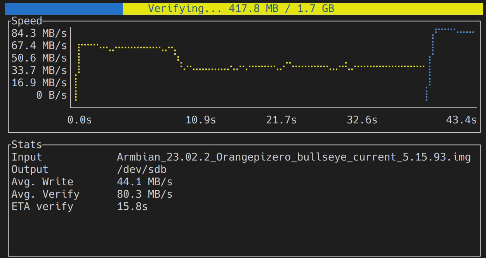

# Caligula Burning Tool

[](https://github.com/ifd3f/caligula/actions/workflows/ci.yml)



_Caligula_ is a user-friendly, lightweight TUI for imaging disks.

```
$ caligula burn -h
A lightweight, user-friendly disk imaging tool

Usage: caligula burn [OPTIONS] <INPUT>

Arguments:
  <INPUT>  Input file to burn

Options:
  -o <OUT>                         Where to write the output. If not supplied, we will search for possible disks and ask you for where you want to burn
  -z, --compression <COMPRESSION>  What compression format the input file is in [default: ask] [possible values: ask, auto, none, gz, bz2, xz]
  -s, --hash <HASH>                The hash of the input file. For more information, see long help (--help) [default: ask]
      --hash-of <HASH_OF>          Is the hash calculated from the raw file, or the compressed file? [possible values: raw, compressed]
      --show-all-disks             If provided, we will show all disks, removable or not
      --interactive <INTERACTIVE>  If we should run in interactive mode or not [default: auto] [possible values: auto, always, never]
  -f, --force                      If supplied, we will not ask for confirmation before destroying your disk
      --root <ROOT>                If we don't have permissions on the output file, should we try to become root? [default: ask] [possible values: ask, always, never]
  -h, --help                       Print help (see more with '--help')
  -V, --version                    Print version
```

## Features

- **Small binary** (few megabytes)
- **Cool graphs**
- **Listing attached disks**, and telling you their size and hardware model information
- **Rich confirmation dialogs** so you don't accidentally nuke your filesystem
- **Decompressing** your input file for a variety of formats, including gz, bz2, and xz
- **Validating your input file against a hash before burning**, with support for md5, sha1, sha256, and more!
- **Running sudo/doas/su** if you forgot to run as `root` earlier (it happens)
- **Verifying your disk after writing** to make sure it was written correctly
- **Statically-linked** on the Linux version
- Did I mention _**cool graphs**_?

## How to install

There are a couple of ways to install Caligula.

- **Binary release:** You can download pre-built binaries from [the latest Github release](https://github.com/ifd3f/caligula/releases/latest).
- **Arch User Repository:** We automatically publish binaries to [caligula-bin on the AUR](https://aur.archlinux.org/packages/caligula-bin) with every release.
- **Nix Package Manager:** If your system is flake-enabled, you can fetch Caligula from the `github:ifd3f/caligula` flake (i.e. with `nix run github:ifd3f/caligula`)
- **Build from source:** This is a relatively standard cargo project so you should be able to just `git clone` and `cargo build --release` it.

### Platform support matrix

| Platform         | Automated tests | Automated builds | Published binaries |
|------------------|-----------------|------------------|--------------------|
| `x86_64-linux`   | ✅               | ✅                | ✅                  |
| `x86_64-darwin`  | ✅               | ✅                | ✅                  |
| `aarch64-linux`  | ❌               | ✅                | ✅                  |
| `aarch64-darwin` | ✅               | ✅                | ✅                  |

Linux for other architectures theoretically works, but we are not making any guarantees.

We plan on supporting Windows, FreeBSD, and OpenBSD Eventually™. If you would like support for other OSes and architectures, please file an issue!

## FAQ

### Why did you make this?

Because I wanted a nice, user-friendly wrapper around `dd` that wasn't like, a ~~90~~ 95 MB executable that packages Chromium and eats hundreds of MB of RAM like certain other disk etching softwares do.

### Why is it called "Caligula"?

Because there used to be a tool called Nero Burning ROM, so I chose another crazy Roman emperor to name this software after. It's a very uncreative name and I might rename it later.

### Why is `dd` not good enough for you?

I know how `dd` works. In fact, instead of using `caligula`, I could just do this:

```
$ sha256sum some-image-file.iso.gz
```
> Then, I would have to pause here to confirm that the file has the right SHA.
```
$ gunzip some-image-file.iso.gz
$ lsblk
```
> I pause here to make sure my disk is indeed detected by the OS.
```
$ dd bs=4M if=some-image-file.iso of=/dev/
```
> I pause here to confirm from the output above that I am indeed typing in the correct disk.
```
$ dd bs=4M if=some-image-file.iso of=/dev/sdb
```
> I pause here *one more time* to *double-confirm* that I am indeed typing in the correct disk and that I am *not going to nuke any important disks storing important data*.
```
dd: failed to open '/dev/sdb': Permission denied
```
> I forgot to type sudo.
```
$ sudo dd bs=4M if=some-image-file.iso of=/dev/sdb
```
> There is no output, but I'd like to see the progress.
```
^C^C^C
$ sudo dd bs=4M if=some-image-file.iso of=/dev/sdb status=progress
```
Finally it's written!

At this point, I don't even bother to verify that the disk was written correctly because I don't know the command to do that, and — let's be real — I don't think many other people do either.

Of course, instead of that whole song and dance, I could just type

```
$ caligula burn some-image-file.iso.gz
```

and have the computer fill in the blanks because computers are good at filling in blanks, that's why they're there. It's not that I don't know how to use `dd`, it's just that after flashing so many SD cards and USBs, I'd rather do something less error-prone.

### Why Rust?

Because it's 🚀🚀🚀 BLAZING FAST 🚀🚀🚀 and 💾💾💾 MEMORY SAFE 💾💾💾

### Why Nix?

It makes the CI more predictable.

### Why so many other dependencies?

To be fair, Rust doesn't have a very comprehensive standard library, and I only use one or two functions in most of those dependencies. Thanks to dead code elimination, inlining, and other optimizations, they don't end up contributing much to the overall binary size.

### Will the binary ever get bigger?

I want to keep the binary very small, or at least as small as I can make it. My current soft limit is to keep the x86_64-linux version under 4MB. This value may change with time or as features are added, but I don't want the binary to be anywhere near what an average Electron app is at. As of v0.4.3, it's only 2.77MB, which is not too bad!

### Why do you have to type in `burn`? Will you add other subcommands later?

Yes. I Eventually™ plan on adding Windows install disk support and that will likely be its own subcommand.
